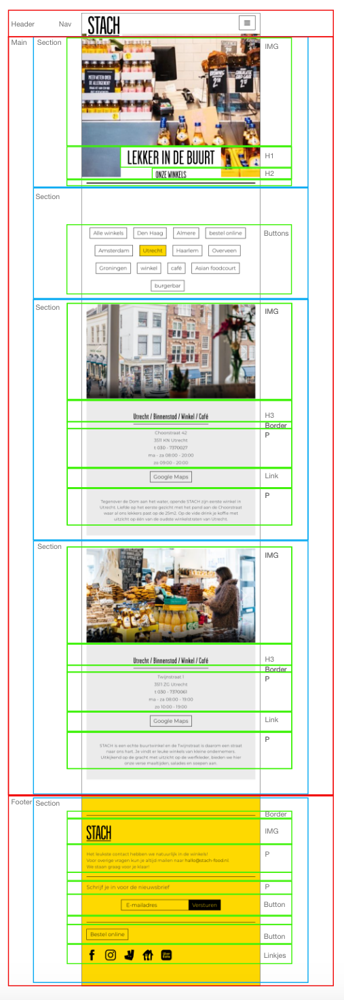
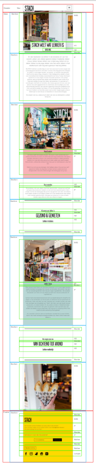

# Procesverslag
Markdown is een simpele manier om HTML te schrijven.  
Markdown cheat cheet: [Hulp bij het schrijven van Markdown](https://github.com/adam-p/markdown-here/wiki/Markdown-Cheatsheet).

Nb. De standaardstructuur en de spartaanse opmaak van de README.md zijn helemaal prima. Het gaat om de inhoud van je procesverslag. Besteedt de tijd voor pracht en praal aan je website.

Nb. Door *open* toe te voegen aan een *details* element kun je deze standaard open zetten. Fijn om dat steeds voor de relevante stuk(ken) te doen.

## Jij

  
uitwerken voor kick-off werkgroep

  ### Auteur:
  Sasja de Boer

  #### Je startniveau:
  Blauw

  #### Je focus:
  Responsive
 

## Je website

  
uitwerken voor kick-off werkgroep

  ### Je opdracht:
  <a href="https://stach-food.nl">Stach</a>

  #### Screenshot(s) van de eerste pagina (small screen): 
  Stach - Winkel
  

  #### Screenshot(s) van de tweede pagina (small screen):
  Stach - Over ons
  
 

## Toegankelijkheidstest 1/2 (week 1)

  
uitwerken na test in 1e werkgroep

  ### Bevindingen
  Lijst met je bevindingen die in de test naar voren kwamen:

  #### Screenreader
  - Bij de screenreader begon die in de footer met de nieuwsbrief. 
  - Bij heel veel dingen werd link gezegd terwijl het geen link is of had moeten zijn. 
  - Bij de afbeeldingen werd er gezegd dat er knoppen waren. Dus ik denk dat er een soort van knoppen onder de afbeeldingen zaten. Er zaten ook echte knoppen over de afbeelding, maar er werd niet echt goed benoemd wat deze waren, want het waren pijltjes dus best handig om te weten.
  - Hij leest eerst de H2 voor en dan de H1, ze staan ook wel in deze volgorde in de html. Maar je wilt eigenlijk dat de H1 eerst voorgelezen wordt.

  #### Muis en Toetsenbord 
  Met het tabben deed hij het pas na 3 keer, dus waarschijnlijk was die al ergens bezig maar kon ik het niet zien. Daarna ging de meteen naar het invulveld voor de nieuwsbrief (staat in de footer). Toen ging die pas naar helemaal boven. Dit kan je oplossen daar de html goed te schrijven zodat hij dit goed leest. Wanneer je tabt worden de elementen met blauw omringt, maar dit is niet heel duidelijk zichtbaar. Dit kan opgelost worden door de kleur aan te passen.

  #### Motoriek (shocks, elastiekjes)
  Ik had getest met de elastiekjes. Op mijn laptop ervaarde ik geen problemen, er zijn ook niet echt moeilijke of kleine dingen op de website dus dat ging goed. OP de telefoon werd het al wat lastiger, dat kwam ook omdat het lastig was om de telefoon goed vast te houden. Het was lastig om bij het hamburger menu te komen, dit kan opgelost worden door het menu-icon wat groter te maken zodat er beter op geklikt kan worden. De buttons op de winkels pagina waren opzich wel goed aan te klikken, soms klikte je verkeerd of moet je de telefoon een beetje draaien om goed bij de button te komen. Dit kan eventueel opgelost worden door de buttons iets groter te maken.

  #### Visueel (brillen, contrast, kleurenblind, dark/light). 
  Ik heb getest met de Combined loss bril en de Central field loss bril. Bij de Combined loss bril zaten er vlekken op de bril dus het duurde langer om te zien waar dingen staan en om de teksten te lezen.
  Bij de Central field loss zat er dus een vlek midden op de bril. Ik zag echt weinig en het was nog best lastig om echt voor je te blijven kijken, want je wilt eigenlijk gewoon om de stip heen kijken.

## Breakdownschets (week 1)

  
uitwerken na afloop 2e werkgroep

  ### Eerste pagina: 
  

  ### Tweede pagina:
  

## Voortgang 1 (week 2)

  
uitwerken voor 1e voortgang

  ### Stand van zaken
  De opdrachten maken ging vaak wel goed. Ik kon van de blauwe piste vaak alle opdrachten wel maken, maar rood lukte nog niet. Met de website maken was ik eerst begonnen om alle content erin te zetten en toen wilde ik beginnen aan de css, maar het werd een beetje rommelig. Ik heb toen ervoor gekozen om gewoon bovenaan de pagina te beginnen en zo verder naar beneden te werken. Ik vind het wel nog lastig om wat we in de opdrachten leren toe te passen op de website, ik weet soms nog niet precies wat ik waarvoor kan/moet gebruiken. Daardoor duurt alles veel langer en ben ik heel veel aan het op- en uitzoeken.
  

  ### Agenda voor meeting
  samen met je groepje opstellen

  | Jeannet                      | Mischa             | Naïm         | Sasja                             |
  | ---                          | ---                | ---          | ---                               |
  | Video readme                 | Witruimte          | ...          | Hamburgermenu responsive          |
  | Dynamische breakdown schets  | ...                | ...          | Wanneer flexbox, grid of position |             
  | ...                          | ...                | ...          | ...                               |

  ### Verslag van meeting
  hier na afloop snel de uitkomsten van de meeting vastleggen

  - Menubalk met hamburger menu komt volgende week met javascript, dus eerst verder werken aan de site en dan volgende week daar naar kijken. Het handigste is om te beginnen met een klein scherm met daar een hamburger menu en dan een @media te gebruiken wanneer het scherm groter word.
  - De echte website zit best goed in elkaar dus daar goed kijken wat zij gebruiken en dat overnemen. Voor de verschillende winkels/steden flexbox gebruiken met flexwrap en een max-width gebruiken om ervoor te zorgen dat er niet te veel naast elkaar staan.

## Voortgang 2 (week 3)

  
uitwerken voor 2e voortgang

  ### Stand van zaken
  Het is mij een soort van geluk om het hamburger menu voor elkar te krijgen. 
  Eigenlijk wil ik nog dat als het scherm groot genoeg is dat dan het hamburger menu weer weggaat, maar ik ga nog kijken of ik dat verder wil uitzoeken. 
  Voor de rest ben ik wel al redelijk goed op weg, ik heb wel met een paar dingen dat ik niet zo goed weet hoe ik dat zelf kan oplossen.

  ### Agenda voor meeting
  samen met je groepje opstellen

  | Jeannet    | Mischa    | Naïm    | Sasja                                  |
  | ---        | ---       | ---     | ---                                    |
  | ---        | ---       | ...     | In het midden krijgen                  |
  | ---        | ---       | ...     | Het stukje met plaatje en tekst van Utrecht en hoe dat goed onder elkaar komt en als de ruimte er is dat het dan naast elkaar is. |             
  | ...        | ...       | ...     | Zwarte lijnen tussen sommige stukken   |

  ### Verslag van meeting
  hier na afloop snel de uitkomsten van de meeting vastleggen

  - Om sommige dingen in het midden te krijgen kan ik beter "margin-left: auto;" gebruiken, als die andere niet goed werken.
  - Om de elementen naast elkaar te krijgen moet ik gebruik maken van media query met display flex. 
  Dit moet ik wel nog uitzoeken hoe dit precies werkt.
  - Om een zwarte lijn bij sommige dingen te krijgen kan ik "border-top of border-bottom" gebruiken. 

## Toegankelijkheidstest 2/2 (week 4)

  
uitwerken na test in 8e werkgroep

  ### Bevindingen
  Lijst met je bevindingen die in de test naar voren kwamen (geef ook aan wat er verbeterd is):

  #### Screenreader
  Veel dingen gingen goed met de screenreader er waren twee dingen die opvielen en nog niet helemaal goed waren:
  - De screenreader leest niet alle images, eigenlijk alleen de bovenste afbeelding. Dus hier moet ik nog even naar kijken zodat de screenreader wel zegt dat er een afbeelding staat.
  - Op mijn pagina staat bijna helemaal boven aan een H1 en H2, de H2 staat alleen boven de H1 als opmaak maar daardoor las de screenreader eerst de H2 en daarna pas de H1. Dit heb ik opgelost door in de HTML eerst de H1 en dan H2 te plaatsen en dan in de css met flexbox en flex-direction dit weer om te draaien.
  

  #### Muis en Toetsenbord 
  Wanneer je begint met tabben dan al snel bij het hamburger menu loop je tegen een probleem aan, want wanneer je daarin tabt dan zie je niet dat je in het hamburger menu bent. De oplossing hiervoor is .....

  De kleur van het tabben is nog standaard blauw, dus soms viel dat niet goed op. Dit kan ik oplossen door de kleur en de dikte aan te passen zodat het wat meer opvalt.

  De states van de knoppen moeten nog aangepast worden het viel nu bijvoorbeeld niet op op welke pagina je was.

  #### Motoriek (shocks, elastiekjes)
  Ik heb getest met de elastiekjes. Op de laptop ging dit voor mijn site nog wel redelijk. Ik heb niet veel kleine knoppen, alleen met de knoppen op de pagina van de winkels was het ietsjes lastiger. Dus ik heb er wel voor gekozen om die knoppen iets groter te maken zodat het klikken wat makkelijker gaat.
  Hier korte omschrijving (met indien nodig afbeeldingen)

  #### Visueel (brillen, contrast, kleurenblind, dark/light). 
  Ik heb getest met de blur bril. Ik vond het met deze bril uberhaupt lastig om iets te zien. De plaatjes kwa kleur zag je wel nog een soort van goed, je zag iniedergeval dat er een plaatje was. 
  De buttons op de pagina van de winkels waren er slecht te zien, het leek net één grote knop. Dus deze ga ik ook iets verder uit elkaar zetten en duidelijker maken welke knop geselecteerd is.
  De tekst op sommige delen was niet eens te zien dat er tekst was, het leek meer op een zwarte vlek. Dus deze tekst zal ik iets groter maken.

## Voortgang 3 (week 4)

  
uitwerken voor 3e voortgang

  ### Stand van zaken
  Ik heb het stukje met de media query los gelaten, het lukte mij niet helemaal en ik wil mij toch meer focussen op de animaties. 
  Dus misschien als ik nog tijd heb dat ik het dan nog ga uitzoeken.
  Het is deze week gelukt om de hele basis van de website zo te krijgen dat ik tevreden ben en dat alles goed werkt.
  Ik moet mij nu nog even gaan richten op animaties om die er allemaal in de krijgen en dark mode.
  Ook moet ik nog de states van buttons maken.

  ### Agenda voor meeting
  samen met je groepje opstellen

  | Jeannet      | Mischa          | Naïm    | Sasja            |
  | ---          | ---             | ---     | ---              |
  | ---          | ---             | ---     | Letters springen is nu op een hover, kan dat ook met een klik?    |
  | ---          | ---             | ---     | ---              |
  | ...          | ...             | ...     | ...              |

  ### Verslag van meeting
  hier na afloop snel de uitkomsten van de meeting vastleggen

  - punt 1
  - punt 2
  - nog een punt
  - ...

## Eindgesprek (week 5)

  
uitwerken voor eindgesprek

  ### Je uitkomst - karakteristiek screenshots:
  

  ### Dit ging goed/Heb ik geleerd: 
  Korte omschrijving met plaatjes

  

  ### Dit was lastig/Is niet gelukt:
  Korte omschrijving met plaatjes

  

## Bronnenlijst

  
continu bijhouden terwijl je werkt

  Nb. Wees specifiek ('css-tricks' als bron is bijv. niet specifiek genoeg).

  1. bron 1
  2. bron 2
  3. ...

